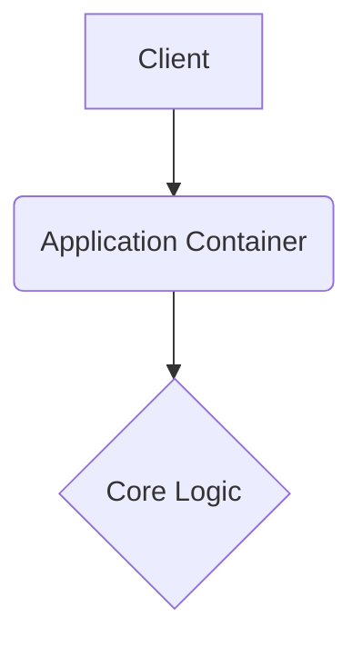

# NMAMIT-Exam-Question-Bank

This repository is built with strict enterprise engineering standards, focusing on resilient architecture, graceful error handling, and robust continuous integration.

## 🏗️ System Architecture



## 🚀 Setup Instructions

```bash
docker-compose up --build -d
```

## 📂 Structure

Following standard design patterns for a predictable layout.

---

## Original Readme

# NMAMIT Exam Question Bank

A comprehensive collection of IV Semester B.E./B.Tech examination question papers from NMAM Institute of Technology, Nitte, organized by subject and exam type.

## 📋 Overview

This repository contains a complete question bank compiled from multiple sources:
- **33+ WhatsApp images** of scanned exam papers
- **Multiple PDF sources** including MSE-I, MSE-II, and SEE papers
- Papers from **2022-2025** academic years

## 📚 Subjects Covered

1. **Linear Algebra (MA2005-1)**
   - MSE-I: February 2025
   - MSE-II: April 2025
   - SEE: July 2023, June 2022

2. **Design & Analysis of Algorithms (CS3004-1)**
   - MSE-I: February 2025
   - MSE-II: April 2025
   - SEE: July 2023, June 2022

3. **Microprocessor & Microcontroller (EC4002-1)**
   - MSE-I: February 2025
   - MSE-II: April 2025
   - SEE: July 2023

4. **Software Engineering & Project Management (CS2103-1)**
   - MSE-I: February 2025
   - MSE-II: April 2025
   - SEE: July 2023

5. **Database Management Systems (CS2102-1)**
   - MSE-II: April 2025

6. **Probability and Statistics**
   - SEE: June 2022

## 📁 File Structure

```
├── README.md                          # This documentation file
├── COMPLETE_QUESTION_BANK.tex         # Main LaTeX source (comprehensive)
├── COMPLETE_QUESTION_BANK.pdf         # Compiled final PDF
├── FINAL_QUESTION_BANK.pdf            # Alternative merged PDF
│
├── Individual Papers (LaTeX + PDF):
│   ├── paper1_linear_algebra_july2023.tex/.pdf
│   ├── paper2_daa_july2023.tex/.pdf
│   ├── paper3_microprocessor_july2023.tex/.pdf
│   ├── paper4_sepm_july2023.tex/.pdf
│   ├── paper5_linear_algebra_prob_june2022.tex/.pdf
│   └── paper6_daa_june2022.tex/.pdf
│
├── Source Files:
│   ├── source_exam_bank.pdf           # Original merged source
│   ├── mse2_source.pdf                # MSE-II April 2025 papers
│   ├── mse papers.pdf                 # Additional MSE papers
│   └── exam_question_bank.pdf         # Intermediate compilation
│
├── Source Images (WhatsApp):
│   ├── WhatsApp Image 2026-04-02 at 5.31.52 PM.jpeg   # and variants
│   ├── WhatsApp Image 2026-04-02 at 5.31.53 PM.jpeg   # ... (33+ images)
│   ├── WhatsApp Image 2026-04-03 at 7.47.06 AM.jpeg
│   └── ... (all source images)
│
└── Extracted Pages (for processing):
    ├── mse2_page-1.png through mse2_page-8.png
```

## 🛠️ How This Was Created

### Step 1: Image Extraction
- Viewed and transcribed 33+ WhatsApp images of exam papers
- Extracted text content preserving mathematical notation

### Step 2: Individual Paper Compilation
Created separate LaTeX files for each paper:
- `paper1_linear_algebra_july2023.tex` - Linear Algebra SEE July 2023
- `paper2_daa_july2023.tex` - DAA SEE July 2023
- `paper3_microprocessor_july2023.tex` - Microprocessor SEE July 2023
- `paper4_sepm_july2023.tex` - SEPM SEE July 2023
- `paper5_linear_algebra_prob_june2022.tex` - LA + Probability June 2022
- `paper6_daa_june2022.tex` - DAA SEE June 2022

### Step 3: PDF Integration
- Merged additional PDFs: `exam_question_bank.pdf`, `mse papers.pdf`, `mse 2.pdf`
- Used pdf-lib for PDF merging
- Used pdftoppm for page extraction

### Step 4: Final Organization
Created `COMPLETE_QUESTION_BANK.tex` with structure:
```
Part: Subject Name
├── Section: MSE-I
│   └── Subsection: Month Year
├── Section: MSE-II
│   └── Subsection: Month Year
└── Section: SEE
    └── Subsection: Month Year
```

### Step 5: Compilation
```bash
pdflatex COMPLETE_QUESTION_BANK.tex
pdflatex COMPLETE_QUESTION_BANK.tex  # Run twice for TOC
```

## 📦 Requirements

To compile the LaTeX files, you need:
- **MiKTeX** or **TeX Live** distribution
- Required packages:
  - `amsmath`, `amssymb` (math symbols)
  - `tikz` (diagrams)
  - `enumitem` (custom lists)
  - `fancyhdr` (headers/footers)
  - `geometry` (page layout)
  - `array`, `booktabs` (tables)
  - `hyperref` (links)
  - `tocloft` (table of contents)
  - `xcolor` (colors)

## 🔧 Compilation Instructions

### Using Command Line
```bash
# Single paper
pdflatex paper1_linear_algebra_july2023.tex

# Complete question bank (run twice for TOC)
pdflatex COMPLETE_QUESTION_BANK.tex
pdflatex COMPLETE_QUESTION_BANK.tex
```

### Using MiKTeX TeXworks
1. Open `.tex` file in TeXworks
2. Select `pdfLaTeX` from dropdown
3. Click green play button (run twice for TOC)

## 📄 Paper Format

### MSE Papers (Mid Semester Exam)
- **Duration:** 1 hour
- **Maximum Marks:** 15-20
- **Part A:** MCQs (3-4 questions × 1 mark each)
- **Part B:** Descriptive (2 questions × 6-8 marks each)
- Includes BT (Bloom's Taxonomy), CO (Course Outcome), PO (Program Outcome) columns

### SEE Papers (Semester End Exam)
- **Duration:** 3 hours
- **Maximum Marks:** 100
- **Part A:** Short answer questions
- **Part B:** Long answer questions with internal choice

## 📝 Content Summary

| Subject | MSE-I | MSE-II | SEE | Total Questions |
|---------|-------|--------|-----|-----------------|
| Linear Algebra | ✅ | ✅ | ✅ | ~30 |
| DAA | ✅ | ✅ | ✅ | ~30 |
| Microprocessor | ✅ | ✅ | ✅ | ~25 |
| SEPM | ✅ | ✅ | ✅ | ~25 |
| DBMS | - | ✅ | - | ~10 |
| Probability | - | - | ✅ | ~15 |

## 🗓️ Exam Timeline Covered

- **June 2022** - SEE papers
- **July 2023** - SEE papers  
- **February 2025** - MSE-I papers
- **April 2025** - MSE-II papers
- **May 2025** - SEE papers

## ⚠️ Notes

1. **Mathematical Notation**: All formulas use proper LaTeX math mode
2. **Diagrams**: Complex diagrams (AVL trees, graphs) included using TikZ
3. **Tables**: BT/CO/PO marking tables preserved where applicable
4. **Original Format**: Question numbering and structure preserved from originals

## 📖 Usage

1. **For Study**: Open `COMPLETE_QUESTION_BANK.pdf` for organized reference
2. **For Editing**: Modify `.tex` files and recompile
3. **For Printing**: Use individual paper PDFs for specific subjects

## 🤝 Contributing

To add new papers:
1. Add source images/PDFs to the folder
2. Transcribe content to appropriate section in `COMPLETE_QUESTION_BANK.tex`
3. Follow existing format for consistency
4. Recompile and verify

## 📜 License

This is an educational resource compiled for student reference. All original questions are property of NMAM Institute of Technology.

---

**Institution:** NMAM Institute of Technology, Nitte  
**Program:** B.E./B.Tech IV Semester  
**Academic Years:** 2022-2025

*Last Updated: April 2025*
